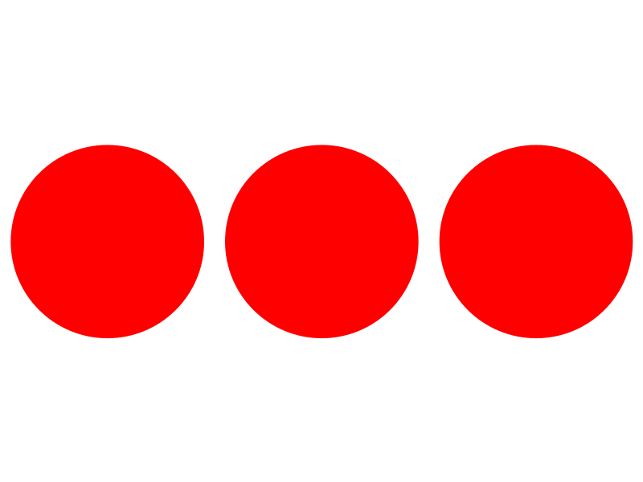
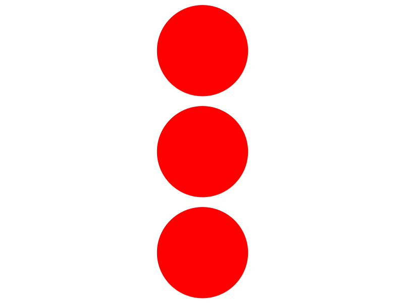
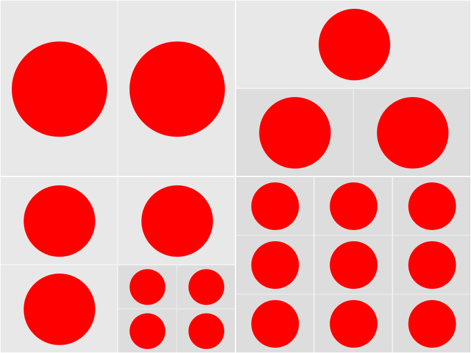

# pixijs-layout

[](https://github.com/samwho/pixijs-layout/blob/main/LICENSE) [](https://www.npmjs.com/package/pixijs-layout) [](https://github.com/samwho/pixijs-layout/actions)

This library is designed to make laying out elements on a canvas very easy.
I've been using PixiJS to write visual explanations of programming concepts
over at <https://samwho.dev>, and this library tailors specifically to my
use-case.

I tried <https://pixijs.io/layout/> and found it didn't easily suit the work
I was trying to do.

## Installation

```
npm install pixijs-layout
```

## Examples

> The tests for this project are the best place to find examples. Every test renders a component to a canvas and saves an image of it in the `screenshots/` directory. All tests are in `tests.ts` and each screenshot is named directly after the test.

All of the examples will assume the following structure:

```typescript
import * as PIXI from "pixi.js";

let canvas = document.createElement("canvas");
canvas.width = 800;
canvas.height = 600;
document.body.appendChild(canvas);

let app = new PIXI.Application({
  autoStart: false,
  forceCanvas: true,
  view: canvas,
  resizeTo: canvas,
  backgroundColor: 0xffffff,
});

app.renderer.resize(800, 600);

let component = null; // <example code goes here>

app.stage.addChild(component);
component.arrange(app.screen);
```

They also assume the existence of the following helper:

```typescript
import * as PIXI from "pixi.js";

export function circle({
  x,
  y,
  radius,
}: {
  x?: number;
  y?: number;
  radius?: number;
} = {}): PIXI.Graphics {
  let circle = new PIXI.Graphics();
  circle.beginFill(0xff0000);
  circle.drawCircle(x ?? 0, y ?? 0, radius ?? 50);
  circle.endFill();
  return circle;
}
```

### HStack

```typescript
import { HStack } from "pixijs-layout";

let component = HStack(circle(), circle(), circle()).leaves((leaf) =>
  leaf.fit().padding("5%"),
);
```



### VStack

```typescript
import { VStack } from "pixijs-layout";

let component = VStack(circle(), circle(), circle()).leaves((leaf) =>
  leaf.fit().padding("5%"),
);
```



### HStacks in a VStack

```typescript
import { VStack, HStack } from "pixijs-layout";

let component = VStack(
  HStack(circle(), circle(), circle()),
  HStack(circle(), circle(), circle()),
  HStack(circle(), circle(), circle()),
).leaves((leaf) => leaf.fit().padding("5%"));
```


### Grid

```typescript
import { Grid } from "pixijs-layout";

let component = Grid(
  circle(),
  circle(),
  circle(),
  circle(),
  circle(),
  circle(),
  circle(),
  circle(),
  circle(),
).leaves((leaf) => leaf.fit().padding("5%"));
```


### Grid within a grid

```typescript
import { Grid } from "pixijs-layout";

let component = Grid(
  circle(),
  circle(),
  circle(),
  Grid(circle(), circle(), circle(), circle()),
).leaves((leaf) => leaf.fit());
```


### Debugging complex layouts

The `.debug()` modifier on a stack will add light grey backgrounds to show how
the screen is being divided. The more nested the stack, the darker the grey.

```typescript
import { Grid } from "pixijs-layout";

let component = Grid(
  HStack(circle(), circle()),
  VStack(circle(), HStack(circle(), circle())),
  Grid(
    circle(),
    circle(),
    circle(),
    Grid(circle(), circle(), circle(), circle()),
  ),
  Stack(
    Stack(circle(), circle(), circle()),
    Stack(circle(), circle(), circle()),
    Stack(circle(), circle(), circle()),
  ),
)
  .debug()
  .leaves((leaf) => leaf.fit().padding("10%"));
```


